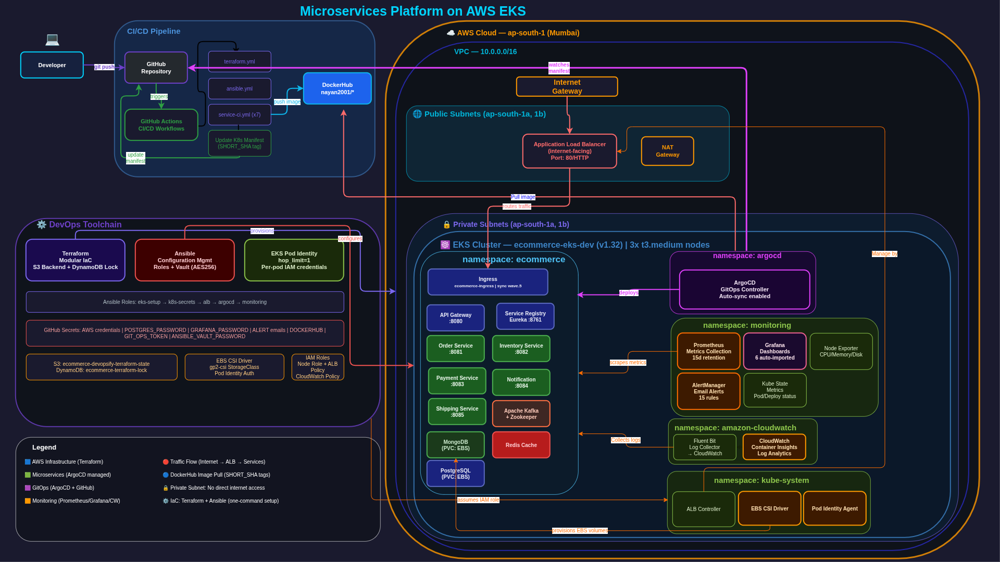

# 🚀 Production-Grade 8-Service Microservices Ecommerce Platform on AWS EKS



> A complete DevOps portfolio project demonstrating production-grade microservices deployment on AWS EKS with full CI/CD automation, GitOps, and observability stack.

---

## 📋 Table of Contents

- [Architecture Overview](#architecture-overview)
- [Tech Stack](#tech-stack)
- [Services](#services)
- [Infrastructure](#infrastructure)
- [CI/CD Pipeline](#cicd-pipeline)
- [GitOps with ArgoCD](#gitops-with-argocd)
- [Monitoring & Observability](#monitoring--observability)
- [Security](#security)
- [Quick Start](#quick-start)
- [Project Structure](#project-structure)

---

## 🏗️ Architecture Overview

```
Internet → ALB → API Gateway → Microservices (Private Subnet)
                                    ↓ Kafka Events
                              Order → Inventory → Payment → Notification → Shipping
```

### Infrastructure Layout

```
AWS VPC (10.0.0.0/16)
├── Public Subnets (ap-south-1a, 1b)
│   ├── Application Load Balancer (internet-facing)
│   └── NAT Gateway
└── Private Subnets (ap-south-1a, 1b)
    └── EKS Cluster (3x t3.medium nodes)
        ├── namespace: ecommerce      → 8 microservices + databases
        ├── namespace: argocd         → GitOps controller
        ├── namespace: monitoring     → Prometheus + Grafana + AlertManager
        ├── namespace: amazon-cloudwatch → Container Insights + Fluent Bit
        └── namespace: kube-system    → ALB Controller + EBS CSI + Pod Identity
```

---

## 🛠️ Tech Stack

### Infrastructure & Cloud
| Tool | Purpose |
|------|---------|
| **AWS EKS** | Managed Kubernetes cluster |
| **AWS VPC** | Network isolation (public/private subnets) |
| **AWS ALB** | Internet-facing load balancer |
| **AWS EBS** | Persistent storage via CSI driver |
| **AWS CloudWatch** | Log aggregation + Container Insights |
| **AWS IAM** | Pod Identity (hop_limit=1, most secure) |
| **Terraform** | Modular IaC (S3 backend + DynamoDB lock) |
| **Ansible** | Configuration management (Vault AES256) |

### CI/CD & GitOps
| Tool | Purpose |
|------|---------|
| **GitHub Actions** | CI per service + Terraform + Ansible workflows |
| **ArgoCD** | GitOps CD (auto-sync + self-heal + prune) |
| **DockerHub** | Container registry (SHORT_SHA versioning) |

### Application
| Tool | Purpose |
|------|---------|
| **Spring Boot 3.2** | Microservices framework |
| **Java 17** | Runtime |
| **Eureka** | Service discovery |
| **Apache Kafka** | Event streaming (Saga pattern) |
| **PostgreSQL** | Orders, Payments, Shipping data |
| **MongoDB** | Inventory, Notifications |
| **Redis** | Caching |

### Monitoring & Observability
| Tool | Purpose |
|------|---------|
| **Prometheus** | Metrics collection (15d retention) |
| **Grafana** | Dashboards (6 auto-imported) |
| **AlertManager** | Email alerts (15 custom rules) |
| **CloudWatch** | Log analytics + Container Insights |
| **Fluent Bit** | Pod log collection → CloudWatch |

---

## 🔧 Services

| Service | Port | Database | Description |
|---------|------|----------|-------------|
| **API Gateway** | 8080 | - | Routes all external traffic |
| **Service Registry** | 8761 | - | Eureka service discovery |
| **Order Service** | 8081 | PostgreSQL | Creates and manages orders |
| **Inventory Service** | 8082 | MongoDB | Stock management |
| **Payment Service** | 8083 | PostgreSQL | Payment processing |
| **Notification Service** | 8084 | MongoDB | Event notifications |
| **Shipping Service** | 8085 | PostgreSQL | Shipment tracking |
| **Kafka + Zookeeper** | 9092 | - | Event streaming |

---

## ☁️ Infrastructure

### Terraform Modules

```
infrastructure/terraform/
├── modules/
│   ├── vpc/        # VPC, subnets, IGW, NAT, route tables
│   ├── eks/        # EKS cluster, node groups, addons, Pod Identity
│   └── security/   # IAM roles, security groups
└── environments/
    ├── dev/        # Dev tfvars
    ├── staging/    # Staging tfvars
    └── prod/       # Prod tfvars
```

### Remote State

```
S3 Bucket: ecommerce-devopsify-terraform-state
Key:       ecommerce/dev/terraform.tfstate
Lock:      DynamoDB — ecommerce-terraform-lock
```

### Security Features

- **EKS Pod Identity** — Per-pod IAM credentials (hop_limit=1, most secure)
- **Private subnets** — All workloads isolated from internet
- **IMDSv2** — Required token-based IMDS access
- **No IRSA** — Replaced with Pod Identity (simpler + more secure)

---

## 🔄 CI/CD Pipeline

### GitHub Actions Workflows

```
.github/workflows/
├── terraform.yml          # Plan + Apply (push to main = dev env)
├── ansible.yml            # Full cluster configuration
├── inventory-service.yml  # Build → Push → Update manifest
├── order-service.yml
├── payment-service.yml
├── notification-service.yml
├── shipping-service.yml
├── api-gateway.yml
└── service-registry.yml
```

### CI Flow (Per Service)

```
Push to main
    ↓
Build JAR (Maven)
    ↓
Build Docker image
    ↓
Push to DockerHub (sha-XXXXXXX tag)
    ↓
Update infrastructure/k8s/<service>/Deployment.yml
    ↓
Commit + Push manifest change
    ↓
ArgoCD detects change → deploys automatically
```

### Image Versioning

```
Tags per push:
→ sha-380023e    (SHORT_SHA — 7 chars, traceable to commit)
→ latest         (always points to newest)
→ main           (branch tag)
```

---

## 🔀 GitOps with ArgoCD

### Application Configuration

```yaml
App:      ecommerce-app
Repo:     github.com/silentknight2001/microservices-ecommerce-8service
Path:     infrastructure/k8s/
Sync:     Automated (prune + self-heal)
```

### Sync Waves (Deployment Order)

```
Wave 0 → Infrastructure (Kafka, MongoDB, PostgreSQL, Redis, Zookeeper)
Wave 1 → Service Registry (Eureka)
Wave 2 → API Gateway
Wave 3 → Business Services (Inventory, Order, Payment, Notification, Shipping)
Wave 5 → Ingress (ALB) — last, after all pods healthy
```

### Access ArgoCD

```bash
kubectl port-forward svc/argocd-server -n argocd 8443:443
# https://localhost:8443
# Username: admin
# Password: kubectl -n argocd get secret argocd-initial-admin-secret \
#             -o jsonpath="{.data.password}" | base64 -d
```

---

## 📊 Monitoring & Observability

### Prometheus + Grafana

```bash
# Grafana
kubectl port-forward svc/grafana -n monitoring 3000:3000
# http://localhost:3000 (admin / <GRAFANA_PASSWORD>)

# Prometheus
kubectl port-forward svc/prometheus-prometheus -n monitoring 9090:9090
# http://localhost:9090
```

### Auto-Imported Grafana Dashboards

| Dashboard | ID |
|-----------|-----|
| Kubernetes Cluster Overview | 15760 |
| Kubernetes All-in-One | 13770 |
| Node Exporter Full | 1860 |
| Kubernetes Pod Details | 6417 |
| Kubernetes Deployments | 7249 |
| Spring Boot JVM | 12900 |

### Alert Rules (15 Total)

| Category | Alerts |
|----------|--------|
| **Pod** | CrashLoopBackOff, OOMKilled, HighRestarts, Pending |
| **Node** | NotReady, HighCPU (>80%), HighMemory (>80%), DiskPressure (<20%) |
| **Storage** | PVCCritical (>90%), PVCPending |
| **JVM** | HeapCritical (>90%), GCTimeTooHigh |
| **Kafka** | KafkaPodDown, ZookeeperPodDown |
| **Deployment** | NotAvailable (0 replicas) |

### CloudWatch

```
Log Groups:
→ /eks/ecommerce/application/  (pod logs via Fluent Bit)
→ EKS control plane logs (API, audit, authenticator)

Retention: 30 days
```

---

## 🔒 Security

| Layer | Implementation |
|-------|---------------|
| **Network** | Private subnets, Security groups, NACLs |
| **IAM** | Pod Identity (per-pod credentials, hop_limit=1) |
| **Secrets** | Ansible Vault (AES256), K8s Secrets |
| **CI/CD** | GitHub Secrets, GIT_OPS_TOKEN, Vault password |
| **Images** | DockerHub with SHORT_SHA versioning |
| **IMDS** | IMDSv2 required (http_tokens=required) |

---

## 🚀 Quick Start

### Prerequisites

```bash
# Required tools
terraform >= 1.12
ansible >= 10.0
kubectl >= 1.30
helm >= 3.15
argocd CLI
aws CLI >= 2.15
```

### 1. Infrastructure Setup

```bash
cd infrastructure/terraform

# Initialize with correct state key
terraform init \
  -backend-config="key=ecommerce/dev/terraform.tfstate" \
  -backend-config="bucket=ecommerce-devopsify-terraform-state" \
  -backend-config="region=ap-south-1" \
  -reconfigure

# Apply
terraform apply \
  -var-file="environments/dev/terraform.tfvars" \
  -auto-approve
```

### 2. Configure Everything (One Command!)

```bash
cd ansible

ansible-playbook playbooks/setup-eks.yml \
  --ask-vault-pass
```

This single command:
- ✅ Updates kubeconfig
- ✅ Sets IMDS hop limit
- ✅ Fixes EBS CSI driver
- ✅ Creates StorageClass
- ✅ Creates K8s secrets
- ✅ Installs ALB Controller
- ✅ Installs ArgoCD + creates app
- ✅ Installs Prometheus + Grafana
- ✅ Installs CloudWatch Container Insights

### 3. Cleanup Before Destroy

```bash
# Run cleanup first (deletes ALB, ArgoCD app, security groups)
ansible-playbook playbooks/cleanup-eks.yml

# Then destroy infrastructure
terraform destroy \
  -var-file="environments/dev/terraform.tfvars" \
  -auto-approve
```

---

## 📁 Project Structure

```
microservices-ecommerce-8service/
├── .github/workflows/          # GitHub Actions CI/CD
│   ├── terraform.yml
│   ├── ansible.yml
│   └── *-service.yml (x7)
├── api-gateway/                # Spring Boot services
├── inventory-service/
├── order-service/
├── payment-service/
├── notification-service/
├── shipping-service/
├── service-registry/
├── common-library/             # Shared DTOs, events
├── infrastructure/
│   ├── terraform/              # Modular IaC
│   │   ├── modules/
│   │   │   ├── vpc/
│   │   │   ├── eks/
│   │   │   └── security/
│   │   └── environments/
│   │       ├── dev/
│   │       ├── staging/
│   │       └── prod/
│   └── k8s/                   # ArgoCD managed manifests
│       ├── api-gateway/
│       ├── inventory-service/
│       ├── order-service/
│       ├── payment-service/
│       ├── notification-service/
│       ├── shipping-service/
│       ├── service-registry/
│       ├── kafka/
│       ├── mongodb/
│       ├── postgresql/
│       ├── redis/
│       ├── zookeeper/
│       ├── storageclass.yml
│       ├── namespace.yml
│       └── ingress.yml
└── ansible/                   # Configuration management
    ├── playbooks/
    │   ├── setup-eks.yml
    │   └── cleanup-eks.yml
    ├── roles/
    │   ├── eks-setup/
    │   ├── k8s-secrets/
    │   ├── alb/
    │   ├── argocd/
    │   ├── monitoring/
    │   └── cleanup/
    └── group_vars/
        └── all.yml
```

---

## 👨‍💻 Author

**Nayan Biswas**
- Self-taught DevOps & Cloud Engineer
- GitHub: [@silentknight2001](https://github.com/silentknight2001)
- DockerHub: [nayan2001](https://hub.docker.com/u/nayan2001)

> *Started learning Linux/DevOps on a mobile phone using Termux in 2014 while working day jobs- Paddy farming,hotel waiter etc... Built this production-grade platform to demonstrate end-to-end DevOps capabilities.*

---

## 📄 License

MIT License — feel free to use this project as a reference for your own DevOps learning journey!